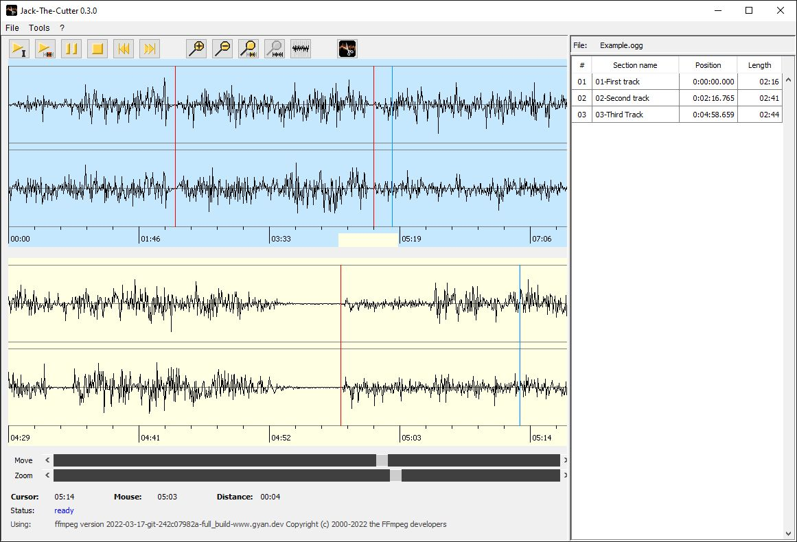

Jack-The-Cutter
==

Jack-The-Cutter is a FFmpeg frontend to lossless cut audio files.

__Usage in short:__

1. open an audio file, any format FFmpeg can process
2. create one or more cut points
3. name each section you want to cut out
4. sections with blank name get skipped
5. finally process the audio file to create a single file for each named section 

Jack-The-Cutter temporary creates an uncompresses WAV file which is used for the editor only.
The cut points are used to <u>lossless cut the original audio</u> file using FFmpeg.

__Features:__

* lossless cut any audio file FFmpeg is capable to process
* the audio wave form is shown twice, the complete form as well as the 'zoomed section', this should imho make cutting a lot easier
* slider to zoom in/out either to/from the centre of the selection or cursor position
* *a few more features are in the queue waiting for implementation*

For more infos please visit [Jack-The-Cutter wiki](https://github.com/Moon70/Jack-The-Cutter/wiki).

